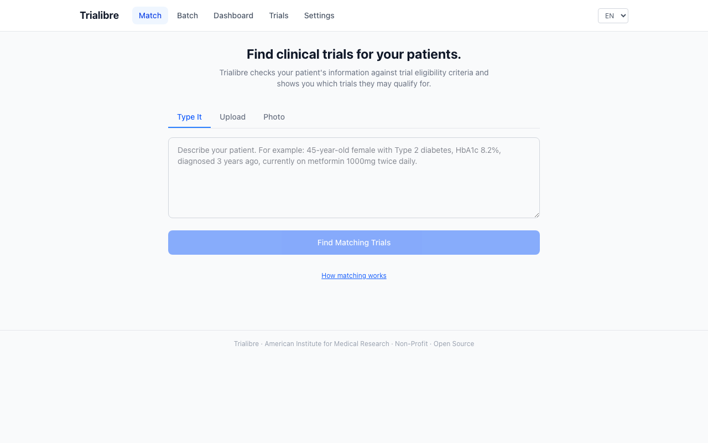
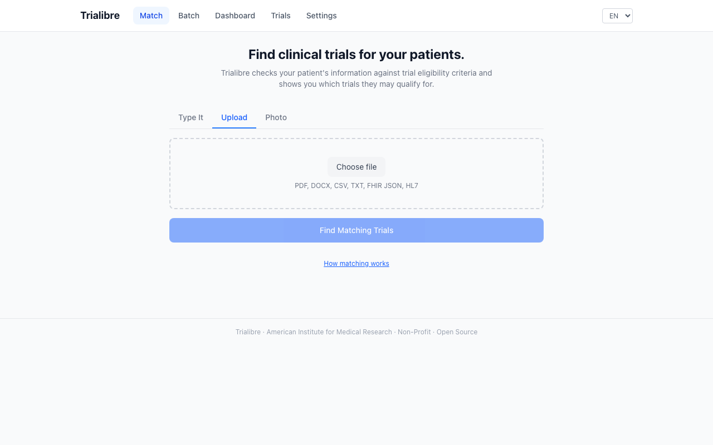
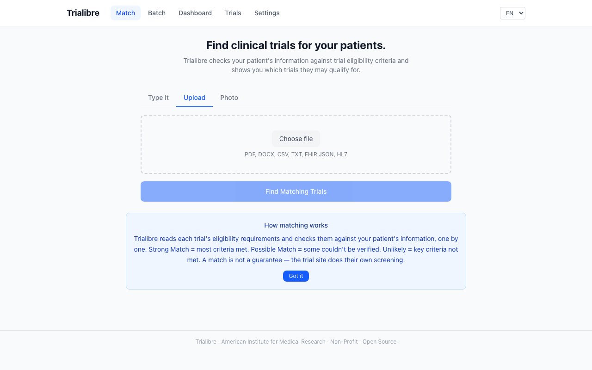
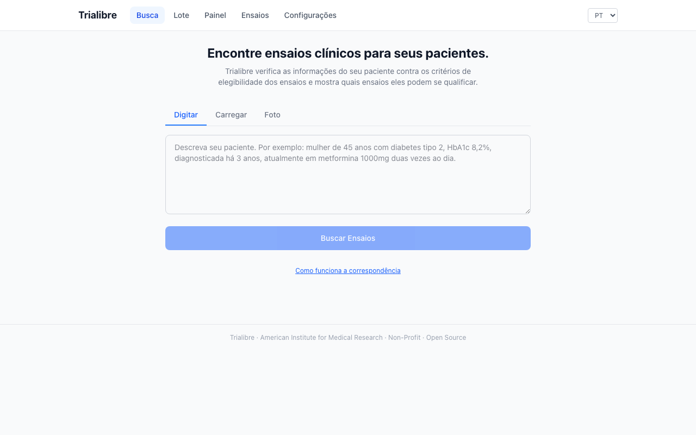
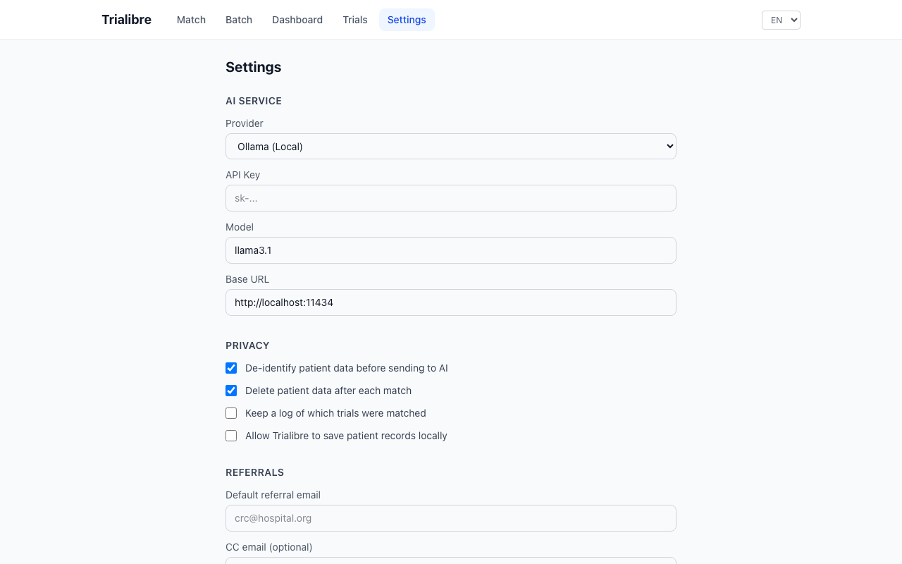
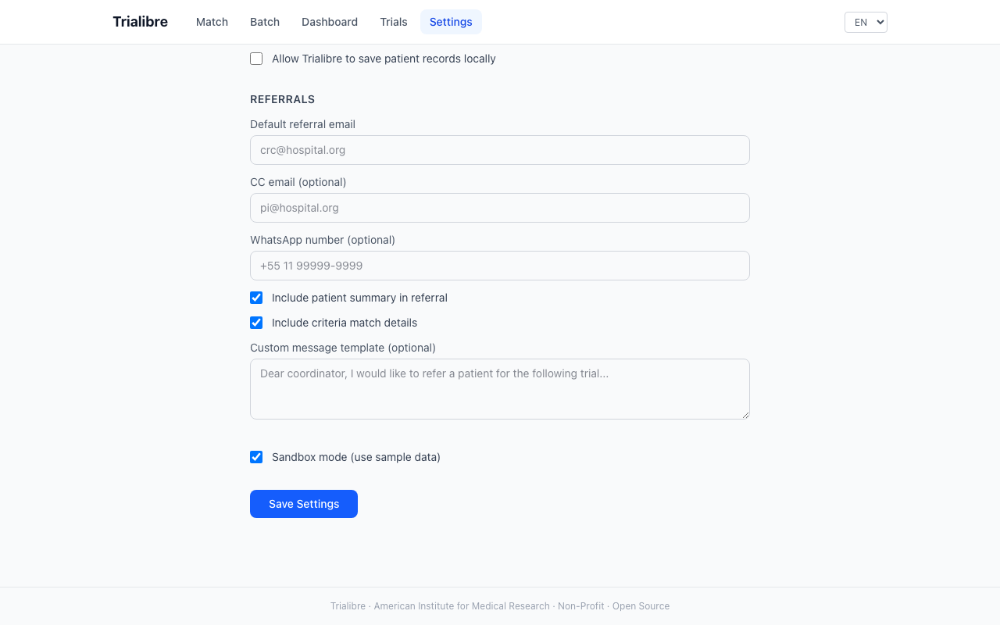
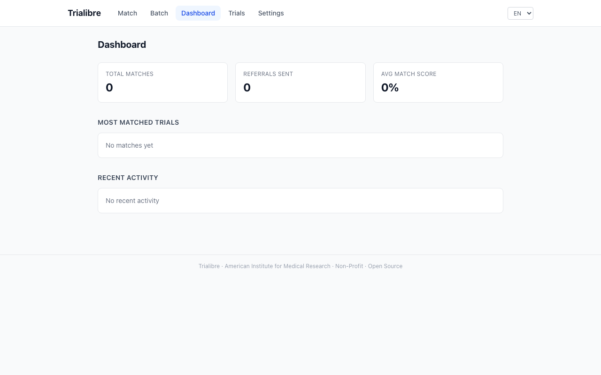
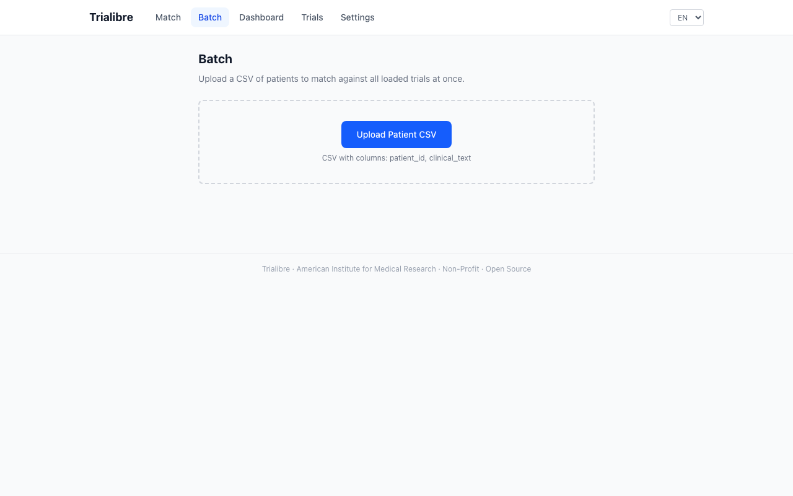
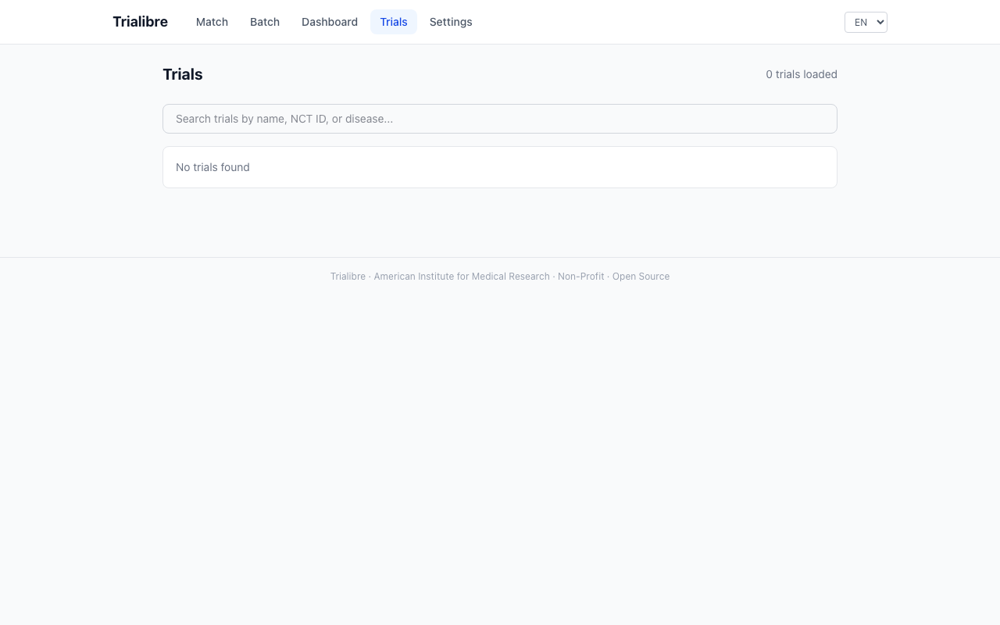
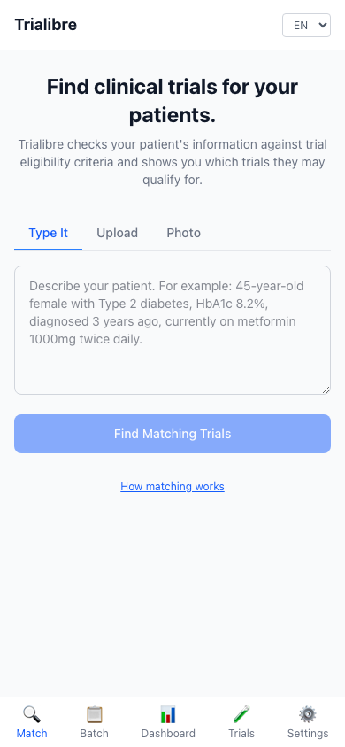

<p align="center">
  <h1 align="center">Trialibre</h1>
  <p align="center">
    Open-source clinical trial matching for everyone.
    <br />
    A project of the <strong>American Institute for Medical Research</strong>, a non-profit organization.
    <br /><br />
    LLM-agnostic &middot; Multilingual &middot; Privacy-first
  </p>
</p>

<p align="center">
  <a href="#quickstart">Quickstart</a> &middot;
  <a href="#screenshots">Screenshots</a> &middot;
  <a href="#features">Features</a> &middot;
  <a href="#architecture">Architecture</a> &middot;
  <a href="#contributing">Contributing</a> &middot;
  <a href="#license">License</a>
</p>

---

<p align="center">
  
</p>

Trialibre helps clinicians and researchers find clinical trials for their patients. Type or upload a patient description, and Trialibre checks it against trial eligibility criteria one by one, then ranks the results by match strength.

Developed and maintained by the [American Institute for Medical Research](https://aimr.org), a non-profit organization dedicated to accelerating clinical research and improving patient access to experimental therapies worldwide.

It works with any LLM backend (Claude, GPT, Ollama, or any OpenAI-compatible API), runs in any language, and keeps patient data under your control.

## Why Trialibre?

Clinical trial matching today is manual and slow. A physician reads through dozens of trial protocols, mentally cross-referencing eligibility criteria against their patient's chart. Most never do it — patients miss trials they could benefit from.

Trialibre automates the screening step. It doesn't replace clinical judgment — it surfaces the trials worth looking at.

**What makes it different:**

- **LLM-agnostic** — Use Claude, GPT-4, Llama 3 via Ollama, or any OpenAI-compatible endpoint. Switch providers without changing anything else.
- **Multilingual** — Patient notes in Portuguese, Spanish, French, Arabic, or English are automatically detected and translated for matching, then results are presented in the original language.
- **Privacy-first** — Built-in de-identification (via Presidio) strips PHI before sending to any cloud LLM. Or run entirely offline with Ollama.
- **Criterion-level explainability** — Every match shows which criteria were met, not met, or couldn't be verified, with plain-language reasoning.
- **Works offline** — BM25 retrieval + local Ollama = no internet needed.

## Screenshots

### Match Page — Patient Input
Type a clinical note, upload a document, or take a photo of a patient record.

<p align="center">
  
</p>

### Multiple Input Methods
Upload PDFs, DOCX, CSV, FHIR JSON, or HL7v2 messages directly.

<p align="center">
  
</p>

### How Matching Works
Built-in explainer helps users understand the matching process and what results mean.

<p align="center">
  
</p>

### Multilingual Interface
Full interface translations — shown here in Portuguese. Also available in Spanish, French, and Arabic.

<p align="center">
  
</p>

### Settings — AI Service & Privacy
Configure your LLM provider, privacy controls, and referral settings in one place.

<p align="center">
  
</p>

### Settings — Referrals
Set default referral recipients, WhatsApp number, and customize the referral message template.

<p align="center">
  
</p>

### Dashboard
Track matching activity, top trials, and referral status.

<p align="center">
  
</p>

### Batch Processing
Upload a CSV of patients to screen against all loaded trials at once.

<p align="center">
  
</p>

### Trial Browser
Browse and search all loaded clinical trials by name, NCT ID, or disease.

<p align="center">
  
</p>

### Mobile Responsive
Full functionality on mobile devices with bottom navigation.

<p align="center">
  
</p>

## Quickstart

### Option 1: pip install (recommended)

```bash
# Clone the repo
git clone https://github.com/matthewhmaxwell/trialibre.git
cd trialibre

# Install the backend
cd backend
pip install -e ".[dev]"

# Start the server (opens browser automatically)
trialibre serve
```

The first run starts in **sandbox mode** with 12 sample patients and 24 trial protocols — no API key needed. Configure your LLM provider in Settings when ready.

### Option 2: Docker

```bash
docker compose up
```

For fully offline operation with a local LLM:

```bash
docker compose --profile local up
```

This starts both Trialibre and an Ollama instance. Pull a model with:

```bash
docker exec -it trialibre-ollama-1 ollama pull llama3.1
```

### Option 3: Frontend development

```bash
cd frontend
npm install
npm run dev
```

## Features

### Patient Input
- **Type it** — Paste or type a clinical note, referral letter, or patient summary
- **Upload** — PDF, DOCX, CSV, FHIR R4 JSON, HL7v2 messages
- **Photo** — Take a photo of a paper record (OCR via Tesseract)

### Matching Pipeline
1. **Retrieval** — BM25 sparse search + optional dense (FAISS) embeddings with reciprocal rank fusion
2. **Criterion Matching** — Each inclusion/exclusion criterion evaluated individually with chain-of-thought reasoning
3. **Ranking** — Combined scoring: relevance (0.4) + eligibility (0.4) + confidence (0.2)
4. **Safety Checks** — Drug interaction flags via basic contraindication database

### Results
- **Strong / Possible / Unlikely** match classifications
- Criteria breakdown: met, not met, to verify
- Nearest trial site with distance
- One-click referral generation (PDF or WhatsApp)
- Batch mode for screening multiple patients

### Privacy
- **De-identification** — Presidio-based NER removes names, dates, IDs before LLM processing
- **Pseudonymization** — Reversible mapping so results can be re-identified locally
- **Delete after match** — Option to purge patient data immediately after results
- **Audit logging** — Track what was processed and when, without storing PHI
- **Fully offline** — Ollama + BM25 = zero data leaves your machine

### Supported LLM Providers
| Provider | Setup |
|----------|-------|
| Anthropic (Claude) | Set `TRIALIBRE_LLM_API_KEY` |
| OpenAI (GPT-4) | Set provider to `openai` + API key |
| Ollama (local) | Install Ollama, pull a model, set base URL |
| Any OpenAI-compatible | Set provider to `openai_compat` + base URL |

## Architecture

```
+-----------------------------------------------------+
|                    Frontend (React)                   |
|  Match Page | Batch | Dashboard | Trials | Settings  |
+------------------------+----------------------------+
                         | REST API
+------------------------+----------------------------+
|                  FastAPI Backend                      |
|                                                      |
|  +---------+  +----------+  +--------+  +--------+  |
|  | Ingest  |  | Privacy  |  |Pipeline|  |  API   |  |
|  | PDF/DOCX|  | De-ID    |  |        |  | Routes |  |
|  | FHIR/HL7|  | Presidio |  |Retrieve|  |        |  |
|  | OCR     |  |          |  | Match  |  |        |  |
|  +---------+  +----------+  | Rank   |  +--------+  |
|                              +---+----+              |
|                                  |                   |
|  +-------------------------------+----------------+  |
|  |           LLM Provider Layer                    |  |
|  |  Anthropic | OpenAI | Ollama | OpenAI-compat    |  |
|  +---------------------------------------------+  |  |
|                                                      |
|  +---------+  +----------+  +-----------------+     |
|  |SQLite DB|  |BM25 Index|  | FAISS (optional)|     |
|  +---------+  +----------+  +-----------------+     |
+------------------------------------------------------+
```

## Project Structure

```
trialibre/
├── backend/
│   ├── src/ctm/
│   │   ├── api/          # FastAPI routes + middleware
│   │   ├── cli/          # CLI (trialibre serve/match) + system tray
│   │   ├── config/       # Settings, YAML config, Jinja2 prompts
│   │   ├── data/         # Registry clients (ClinicalTrials.gov)
│   │   ├── db/           # SQLAlchemy models + migrations
│   │   ├── embeddings/   # Embedding providers (Sentence Transformers)
│   │   ├── evaluation/   # Metrics (P@K, NDCG, criterion accuracy)
│   │   ├── i18n/         # Language detection + translation
│   │   ├── ingest/       # File parsers (PDF, DOCX, FHIR, HL7, OCR)
│   │   ├── models/       # Pydantic domain models
│   │   ├── pipeline/     # Core matching pipeline
│   │   │   ├── retrieval/   # BM25, dense, hybrid retrieval
│   │   │   ├── matching/    # Criterion-level LLM evaluation
│   │   │   └── ranking/     # Score aggregation + ranking
│   │   ├── privacy/      # De-identification engine (Presidio)
│   │   ├── providers/    # LLM provider abstraction layer
│   │   ├── reports/      # PDF report generation
│   │   ├── resilience/   # Circuit breaker, rate limiter, retry
│   │   └── sandbox/      # Sample data loader
│   ├── sandbox/          # 12 patients + 24 protocols + ground truth
│   └── tests/            # pytest suite
├── frontend/             # React + TypeScript + Tailwind
│   └── src/
│       ├── pages/        # Match, Batch, Dashboard, Trials, Settings
│       ├── components/   # TrialCard, PatientInput, FilterBar, etc.
│       ├── hooks/        # useMatch, useSettings
│       └── i18n/         # EN, FR, PT, ES, AR
├── Dockerfile            # Multi-stage build
├── docker-compose.yml    # With optional Ollama sidecar
└── docs/                 # Screenshots + methodology docs
```

## Evaluation

Trialibre includes a built-in evaluation framework with 24 annotated patient-trial pairs across 12 therapeutic areas:

| Metric | Description |
|--------|-------------|
| P@5, P@10 | Precision at K (relevant trials in top K) |
| R@5, R@10 | Recall at K |
| NDCG@5, NDCG@10 | Normalized discounted cumulative gain |
| MRR | Mean reciprocal rank |
| Strength Accuracy | Correct strong/possible/unlikely classification |
| Criterion Accuracy | Per-criterion met/not-met/unknown correctness |

Run a match from the command line:

```bash
trialibre match "45 year old female with Type 2 diabetes, HbA1c 8.2%"
```

## Sandbox Data

The sandbox includes synthetic (fully fictional) data covering 12 therapeutic areas:

**Patients:** Diabetes, NSCLC, Breast Cancer, Alzheimer's, HIV, CKD, Pediatric Asthma, Depression, Sickle Cell Disease, Rheumatoid Arthritis, Malaria, MDR-TB

**Trials:** 24 protocols with realistic inclusion/exclusion criteria, designed to produce strong matches, possible matches, and clear exclusions for each patient.

**Ground Truth:** 24 annotated pairs with expected match strength and clinical rationale.

No API key or external service is needed to explore the full interface with sandbox data.

## Extending

### Adding a new LLM provider

Create a class that implements `LLMProvider`:

```python
from ctm.providers.base import LLMProvider, LLMResponse

class MyProvider(LLMProvider):
    async def complete(self, messages, temperature=0.0, **kwargs) -> str:
        # Your implementation
        ...

    async def health_check(self) -> bool:
        ...
```

Register it in `ctm/providers/registry.py`.

### Adding a language

1. Add detection support in `ctm/i18n/language_detector.py`
2. Add frontend translations in `frontend/src/i18n/{lang}.json`
3. Add Tesseract language pack for OCR: `tesseract-ocr-{lang}`

### Adding a trial registry

Implement a client in `ctm/data/registries/` following the `CTGovClient` pattern.

## Limitations

- Trialibre is a **screening tool**, not a diagnostic or clinical decision system. All matches require verification by a qualified clinician.
- Match quality depends on the LLM used. Larger models (Claude Sonnet, GPT-4) significantly outperform smaller local models on criterion-level reasoning.
- OCR quality varies with document quality. Typed text input produces the best results.
- The drug interaction database is basic and should not be relied upon for clinical decisions.

## Contributing

See [CONTRIBUTING.md](CONTRIBUTING.md) for guidelines. We welcome contributions in all forms — code, translations, documentation, and clinical validation data.

## License

MIT License. See [LICENSE](LICENSE) for details.

## About

Trialibre is developed by the **American Institute for Medical Research (AIMR)**, a non-profit organization. Our mission is to accelerate clinical research and expand patient access to experimental therapies — regardless of geography, language, or institutional resources.

We believe clinical trial matching should be open, transparent, and accessible to every clinician and researcher, not locked behind expensive proprietary platforms.

---

Built by the American Institute for Medical Research for clinicians, researchers, and anyone working to connect patients with the trials that could help them.
